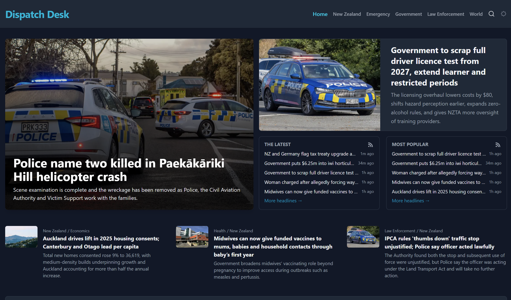

# Dispatch Desk (UI)

An experimental proof-of-concept of a hands-off media platform, exploring how AI can be used in news aggregation, ranking, and presentation of news media.
This repository contains the website and web server component of the project. For the news aggregation and ranking, visit the [DispatchDesk-Newsroom](https://github.com/Rqver/DispatchDesk-Newsroom).

## Why
I have an interest in the news media and wanted to explore where and how AI can and can't be used effectively in this space; There are examples of both in this project. This (frontend) part of the project was an opportunity to explore UI & UX design in this space.

## Running Locally
### Requirements

- [Deno](https://deno.com/) v2.0 or later.
- An instance of Directus available with the Dispatch Desk schema loaded: See the [Newsroom](https://github.com/Rqver/DispatchDesk-Newsroom) repository for instructions.
- (Optional): A [meilisearch](https://www.meilisearch.com/) instance.
- (Optional): A [Umami](https://umami.is/) instance.

### Enviroment Variables
Rename the `.env.example` file to `.env`. The project only requires one environment variable to run, the rest are optional:
- `API_BASE_URL`: The URL to your Directus instance. See the [Newsroom](https://github.com/Rqver/DispatchDesk-Newsroom) repository for instructions.
- (Optional) `PORT`: The port the web server will start on. Will default to `8080` if not set.
- (Optional) `FEEDBACK_WEBHOOK`: The Discord webhook to send feedback form entries to
- (Optional) `MEILISEARCH_SECRET`: Your [MeiliSearch API Key](https://www.meilisearch.com/docs/learn/security/basic_security).
- (Optional) `MEILISEARCH_HOST`: Your Meilisearch instance's URL.
- (Optional) `UMAMI_USERNAME`: [Authentication](https://umami.is/docs/api/authentication) for your Umami instance's API.
- (Optional) `UMAMI_PASSWORD`: [Authentication](https://umami.is/docs/api/authentication) for your Umami instance's API.

### Starting
- Ensure you have [Deno](https://deno.com/) installed.
- Use `deno install` if you haven't already to install the project's dependencies.
- Use `deno task start` to launch the project.